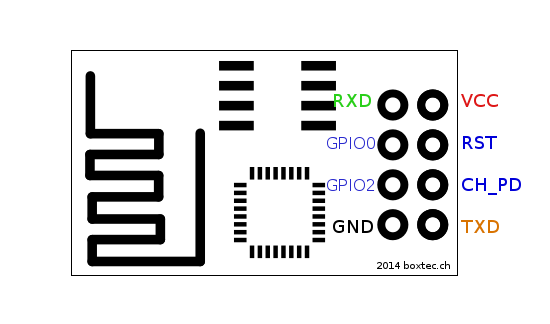

# Installing the firmware

Install the driver:
* [Driver](https://www.silabs.com/Support%20Documents/Software/Mac_OSX_VCP_Driver.zip)

Download esptool.py:
* [Esptool](https://github.com/themadinventor/esptool)

Download espruino:
* [Espruino](https://github.com/nodemcu/nodemcu-firmware/releases)

connect ESP8266 to USBSerial:




Then, run:
```
./esptool.py --port=/dev/cu.usbserial write_flash  -fm=dio -fs=32m 0x00000 nodemcu_float_0.9.6-dev_20150704\ 2.bin
```

It will return:
> Connecting...
> 
> Erasing flash...
> 
> Wrote 462848 bytes at 0x00000000 in 45.4 seconds (81.6 kbit/s)...
> 
> 
> Leaving...

Disconnect and connect the USB again


# Testing


Open Esplorer:
[Esplorer](http://esp8266.ru/esplorer/)

Change configs to:
```
port: /dev/cu.usbserial
baudrate 9600
```
Click on Open, it should show:

> PORT OPEN 9600
> 
> Communication with MCU...
> 
> Got answer! AutoDetect firmware...
> 
> 
> Can't autodetect firmware, because proper answer not received.

Use the following script to do a Hello World:
[https://github.com/nodemcu/nodemcu-devkit/wiki/A-Simple-First-Script](https://github.com/nodemcu/nodemcu-devkit/wiki/A-Simple-First-Script)

After put the script on the left side, press "Save to ESP". It will show the script, line by line, on the right side.

# Fast tests

Open CoolTerm and try:
```
gpio.mode(3, gpio.OUTPUT)
gpio.write(3, gpio.UP)
gpio.write(3, gpio.DOWN)
```

# Useful links
* [https://github.com/nodemcu/nodemcu-firmware/wiki/nodemcu_api_en](https://github.com/nodemcu/nodemcu-firmware/wiki/nodemcu_api_en)
* [https://github.com/nodemcu/nodemcu-devkit/wiki/Getting-Started-on-OSX](
https://github.com/nodemcu/nodemcu-devkit/wiki/Getting-Started-on-OSX)